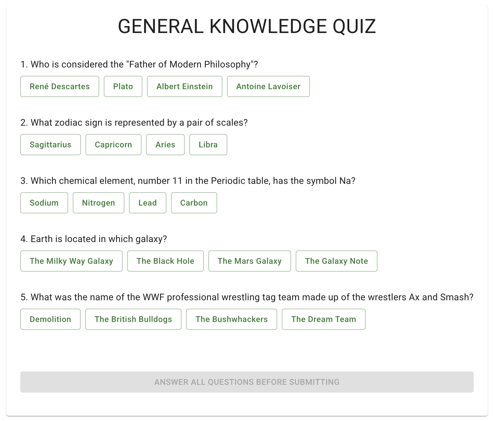
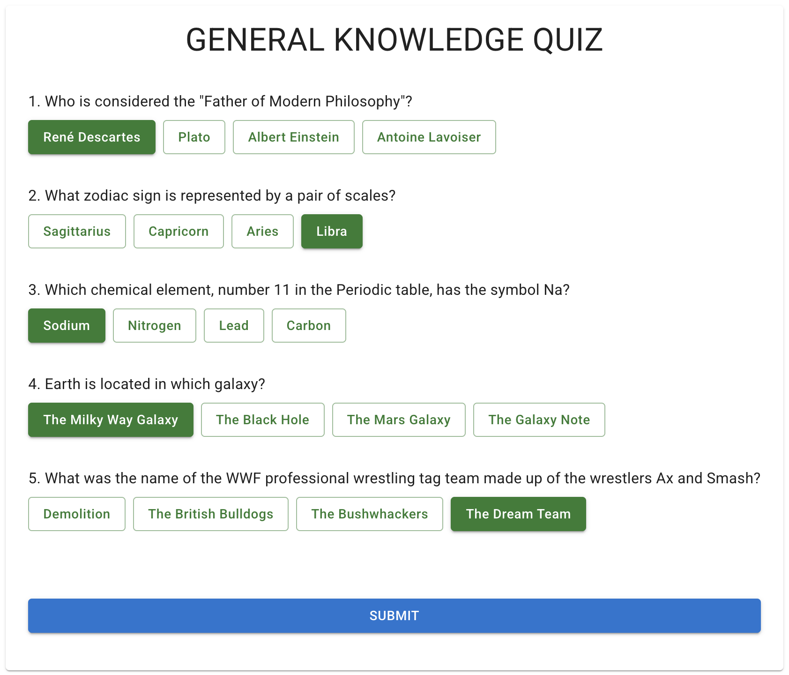
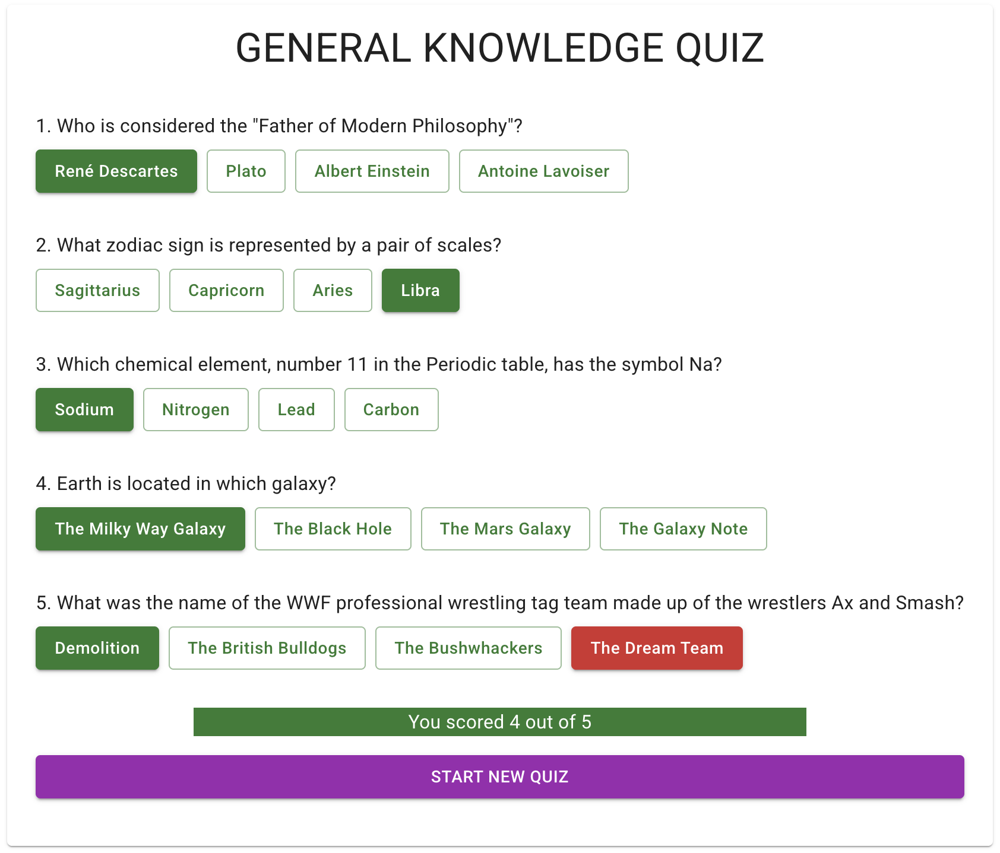

# trivia-quiz-app
A small, full-stack trivia quiz app to demo React / Redux / Express / MongoDB

<div style="width: 100%; display: flex; flex-direction: row; flex-wrap: wrap; justify-content: center; gap: 4px">



</div>

## How to Demo the App
To demo the app, you need to clone this repository locally and have the following dependencies installed on your system:
- [Node.js v22](https://nodejs.org/)
- [Yarn](https://yarnpkg.com/)
- [Docker](https://www.docker.com/)

Once all three are installed, run these commands in your terminal from the root folder of the cloned repository:
```shell
yarn install
```
```shell
yarn demo
```
> **Note**: These commands will run all application processes and seed the database with a default configuration. The `MAX_NUMBER_OF_CATEGORIES` value can be changed in the `.env` file if you would like to seed the database additional categories.

## Overview of Development

#### Boilerplate Usage
This git repository was generated from the [fullstack-typescript](https://github.com/gilamran/fullstack-typescript) boilerplate template to get up and running quickly. This boilerplate was chosen after a brief Google search to compare several available boilerplates as this one comes pre-loaded with:
- [TypeScript](https://www.typescriptlang.org/)
- [React v19](https://react.dev/)
- [React Router](https://reactrouter.com/)
- [Material UI](https://mui.com/)
- [Express v5](https://expressjs.com/)
- [Eslint](https://eslint.org/)
- [Prettier](https://prettier.io/)

#### Additional Dependencies
Besides the dependencies that came with the boilerplate, I added these:
- [Mongoose](https://mongoosejs.com/)
- [Redux Toolkit (RTK)](https://redux-toolkit.js.org/)
-

#### Docker
Docker is used to containerize the MongoDB databse, the server process and the client process. I am not a Docker expert, but I am experienced enough that I used the documentation and some targetted Google searches to help myself craft the *.yml files.

#### Generative AI Usage
Because I use [Cursor](https://www.cursor.com/en) as my go-to IDE, there is always some level of generative AI assistance in the background to populate repetetive code like database schemas, api endpoints, redux RTK Query api endpoints, and Jest test cases. Outside of the Cursor IDE, no other generative AI tools were used.

## Source Code Folder Structure
```
src/
├── client/             # strictly FE code, eg React and Redux
│   ├── components/     # React components
│   ├── redux/          # Redux Toolkit (RTK) files
│       ├── api/        # RTK Query files
│       ├── slices/     # RTK slices
├── scripts/            # miscellaneous scripts, ie seeding the db
├── server/             # strictly BE code, ie the Express server config
│   ├── routes/         # endpoints for routing and the api
├── shared/             # code shared by both BE and FE, eg types and schemas
```