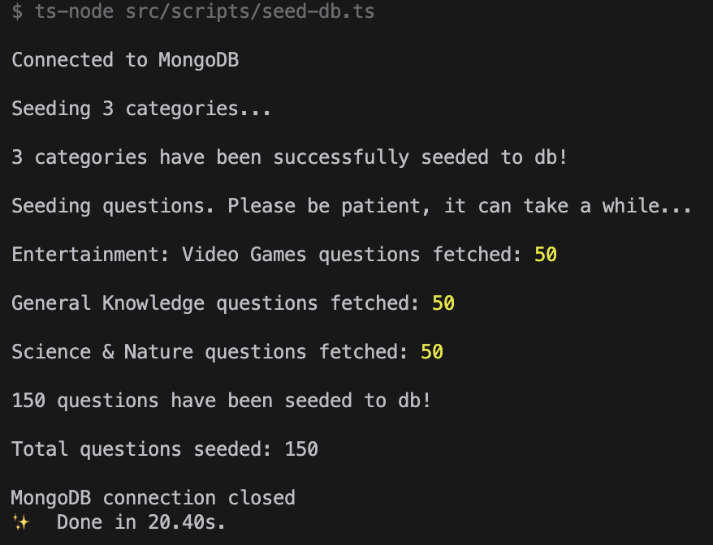
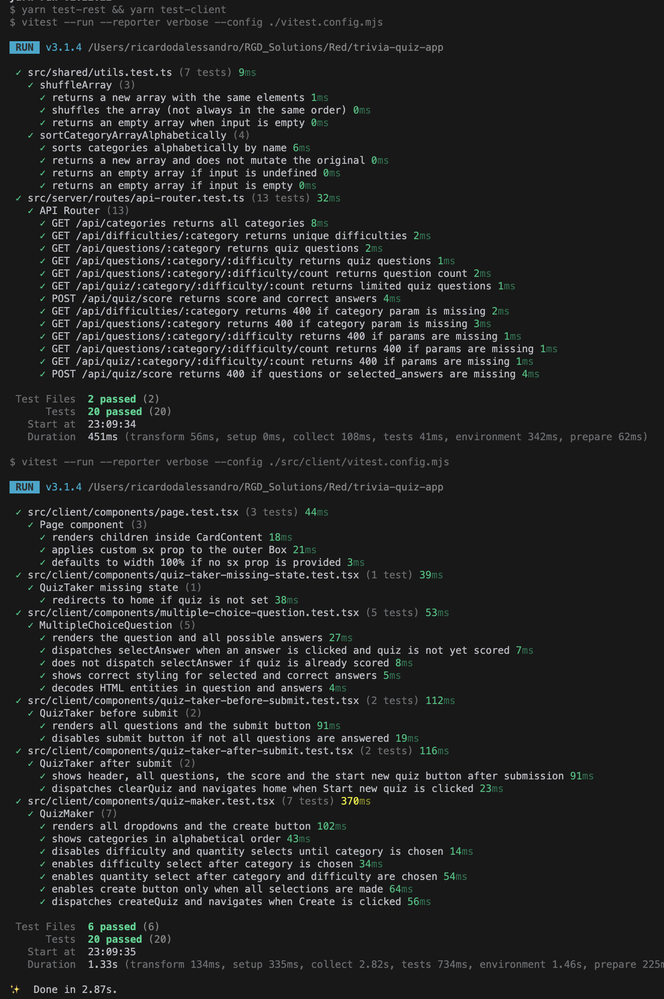

# trivia-quiz-app
A small, full-stack trivia quiz app to demo React / Redux / Express / MongoDB

<div style="width: 100%; display: flex; flex-direction: row; flex-wrap: wrap; justify-content: center; gap: 8px">


</div>

## How to Demo the App
To demo the app, you need to clone this repository locally and have the following dependencies installed on your system:
- [Node.js v22](https://nodejs.org/)
- [Yarn](https://yarnpkg.com/)
- [Docker](https://www.docker.com/)

Once all three are installed, run the following command in your terminal from the root folder of the cloned repository:
```shell
yarn demo
```
> **Note**: This command will run all application processes and seed the database with a default configuration. The `MAX_NUMBER_OF_CATEGORIES` value can be changed in the `.env.demo` file if you would like to seed the database with additional categories (not recommended because of api rate limits).

Next, wait until your terminal shows that the seeding script is completely finished.



Finally, open your browser to http://localhost:3000.

## Overview of Development

#### Boilerplate Usage
This git repository was generated from the [fullstack-typescript](https://github.com/gilamran/fullstack-typescript) boilerplate template to get up and running quickly. This boilerplate was chosen after a brief Google search to compare several available boilerplates as this one comes pre-loaded with:
- [TypeScript](https://www.typescriptlang.org/)
- [React v19](https://react.dev/)
- [React Router](https://reactrouter.com/)
- [Material UI](https://mui.com/)
- [Express v5](https://expressjs.com/)
- [Eslint](https://eslint.org/)
- [Prettier](https://prettier.io/)

#### Additional Dependencies
Besides the dependencies that came with the boilerplate, I added these:
- [Mongoose](https://mongoosejs.com/)
- [Redux Toolkit (RTK)](https://redux-toolkit.js.org/)
- [Vitest](https://vitest.dev/)
- [SuperTest](https://github.com/ladjs/supertest)
- [msw](https://mswjs.io/)
- [React Testing Library](https://testing-library.com/docs/react-testing-library/intro/)

#### Docker
Docker is used to containerize the MongoDB databse, the server process and the client process. I am no Docker expert, but I used the documentation and some targetted Google searches to help myself craft the *.yml files.

#### Generative AI Usage
Because I use [Cursor](https://www.cursor.com/en) as my go-to IDE, there is always some level of generative AI assistance in the background to populate repetetive code like database schemas, api endpoints, redux RTK Query api endpoints, and Vitest test cases. I also used chatGPT to help me troubleshoot my Dockerfile. I tested and validated any and all AI suggestions before commiting them. Outside of the Cursor IDE and chatGPT for the Dockerfile, no other generative AI tools were used.

## Further Development
To further development of this app, you need to clone this repository locally and have the following dependencies installed on your system:
- [Node.js v22](https://nodejs.org/)
- [Yarn](https://yarnpkg.com/)
- [Docker](https://www.docker.com/)

Once all three are installed, run the following command in your terminal from the root folder of the cloned repository:
```shell
yarn install
```
To spin up the MongoDB, run the following command:
```shell
yarn docker-db
```
To seed the database, run the following command:
```shell
yarn seed-db
```
To spin up the development servers with hot-reloading, run the following command:
```shell
yarn dev
```
To view the UI, open your web browser and head to http://localhost:3000/

Before committing new code, it's always recommended to lint and format the code with the following commands:
```shell
yarn lint
```
```shell
yarn format
```

## Source Code Folder Structure
```
src/
├── client/             # strictly FE code, eg React and Redux
│   ├── components/     # React components
│   ├── redux/          # Redux Toolkit files
│   │   ├── api/        # RTK Query endpoints
│   │   ├── slices/     # Redux slices
│   ├── utils/          # Helper methods
├── scripts/            # miscellaneous scripts, ie seeding the db
├── server/             # strictly BE code, ie the Express server config
│   ├── routes/         # endpoints for routing and the api
├── shared/             # code shared by both BE and FE, eg types, schemas, utils
```

## Testing
Vitest is used as the overall test runner for the unit tests of this full-stack application. SuperTest is used in the unit testing of the backend api service to mock the Express server. MSW is used in the unit testing of the frontend code to mock http requests and responses. React Testing Library is used in unit testing of the frontend code to shallow render the React Components and interact with the UI from the point of view of a human user. All test files (\*.test.ts\*) are colocated in the same folder as the feature code they are testing.

To run all tests, run the following command:
```shell
yarn test
```
There are 40 tests in total.

